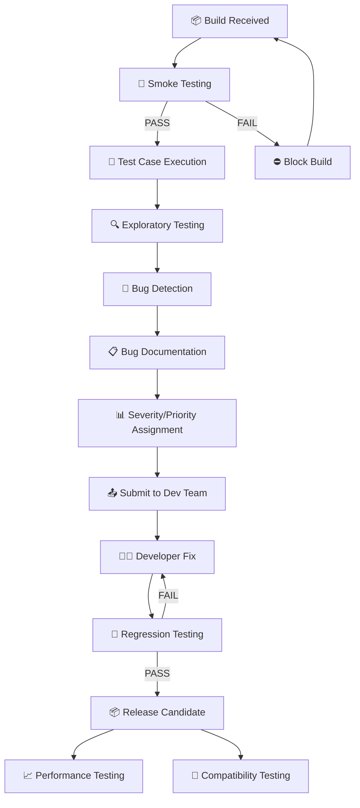

<div align="center">
  
# 🎮 Leeladhar Waghmare
### Game QA Tester (Entry-Level)

[](mailto:leeladharwaghmare43@gmail.com)
[](tel:+918421684071)
[](https://maps.google.com/?q=Nagpur,India)

</div>

---

## 👋 About Me

Aspiring Game QA Tester with hands-on experience testing **closed beta and early-access games**. I love finding bugs that others miss and helping developers create polished gaming experiences.

**What drives me:**
- 🎯 Breaking games to make them better
- 📝 Clear bug documentation that helps developers fix issues fast
- 👥 Being part of the game development process

---

## 🛠️ QA Toolkit

| Area | What I Know |
|------|-------------|
| **Testing Types** | Manual Testing • Exploratory Testing • Functional Testing • Regression Testing |
| **Bug Reporting** | Writing clear steps • Taking screenshots • Recording gameplay • JIRA basics |
| **Tools** | Google Sheets • MS Excel • OBS for recording • JIRA (learning) |
| **Technical** | Basic C/C++/Python • SDLC fundamentals • PC hardware knowledge |
| **Platforms** | PC Games • Android Games |

---

## 🎮 Games I've Tested

| Game | Platform | What I Did |
|------|----------|------------|
| **Rainbow Six Mobile** | Mobile (Beta) | Found 15+ bugs, tested controls, reported crashes |
| **XDefiant** | PC (Beta) | Tested gameplay, reported memory issues |
| **Ubisoft Resurgence** | Mobile (Beta) | UI testing, progression system checks |
| **Google Play Games on PC** | PC (Beta) | Cross-platform compatibility testing |

---

## 📝 Sample Bug Report

### 🐞 Character stuck inside wall after ability use

```
GAME: Rainbow Six Mobile
BUILD: 2.1.4-beta
DEVICE: Pixel 6 (Android 14)

STEPS TO REPRODUCE:
1. Select Sledge operator on Bank map
2. Go to basement destructible wall
3. Use breach charge and immediately dash through
4. Try to move

WHAT SHOULD HAPPEN:
Character moves freely through the opening

WHAT ACTUALLY HAPPENS:
❌ Character gets stuck inside wall
❌ Cannot move or use abilities
❌ Have to restart game

SEVERITY: 🔴 Critical (game breaking)
PRIORITY: 🔥 High
FREQUENCY: Happens 8 out of 10 tries

ATTACHMENTS:
- Screen recording attached
- Screenshots included

NOTE: Only happens at 60+ FPS. 30 FPS works fine.
```

---

## ✅ Sample Test Case

### Testing Inventory System

```
TEST CASE: TC-INV-01
FEATURE: Equipping weapons

BEFORE TESTING:
- Player is logged in
- Has at least 3 weapons in inventory

STEPS TO TEST:
1. Open inventory
2. Select Common Pistol
3. Click "Equip"
4. Check character screen
5. Unequip weapon
6. Try with Rare Rifle
7. Try with Epic Shotgun

WHAT SHOULD HAPPEN:
✓ Weapon appears on character
✓ Stats update correctly
✓ Unequip works properly

WHAT ACTUALLY HAPPENED:
✓ All worked except weapon clips through character model (reported as bug BUG-2024-001)

STATUS: Partially Passed
```

---

## 🔍 Simple Game Analysis Example

### Clash Royale - Quick Observations

**What's Working Well:**
- 👍 Early game (Arenas 1-3) feels balanced and fun
- 👍 Tutorial teaches basics effectively

**Issues Noticed:**
- ⚠️ After Arena 6, matchmaking sometimes pairs me with players 2 levels higher
- ⚠️ Chest unlock timer could be more visible
- ⚠️ Progression feels slow in Arenas 7-8

**Simple Suggestions:**
- Improve matchmaking to consider card levels more
- Add progress bar for chest timers
- Slightly increase gold rewards in mid-game

---

🔄 QA TESTING WORKFLOW



📱 DEVICE TESTING MATRIX
**Simple Breakdown:**
1. **Smoke Test** → Check if game opens and runs
2. **Explore** → Play naturally, try to break things
3. **Found bug?** → Document clearly with steps
4. **Report** → Send to dev team
5. **Test fixes** → Check if bug is really gone
6. **Repeat** → Keep testing until build is stable

---

## 📱 Devices I've Tested On

| Device | Android | Performance |
|--------|---------|-------------|
| Pixel 6 | 14 | ✅ Smooth |
| Samsung S21 | 13 | ⚠️ Minor lag at times |
| Redmi Note 11 | 12 | ✅ Works well |
| Moto G60 | 11 | ⚠️ Some crashes fixed |

---

## 📂 Portfolio Contents

```
📁 Game-QA-Portfolio/
│
├── 📄 README.md                    ← You are here
├── 📁 Bug-Reports/                  ← Sample bugs I found
├── 📁 Test-Cases/                   ← How I test features
├── 📁 Game-Analysis/                 ← My observations
└── 📁 Screenshots/                   ← Bug evidence
```

---

## 🎯 What I'm Looking For

**First job in game QA** where I can:
- 🎮 Test real games launching to players
- 📈 Learn from experienced QA professionals
- 🔍 Grow my bug-hunting skills
- 🤝 Help make games better

**Open to:**
- Full-time QA Tester roles
- Internships
- Contract testing work
- Remote or onsite in Nagpur

---

## ⚡ Quick Facts

| | |
|---|---|
| **Available** | Immediately |
| **Work Type** | Full-time / Internship |
| **Location** | Nagpur (open to remote) |
| **Languages** | English, Hindi, Marathi |
| **Hobbies** | Gaming, Breaking games, Learning new testing tricks |

---

<div align="center">

### 📬 Let's Connect!

**Email:** leeladharwaghmare43@gmail.com  
**Phone:** +91 8421684071  

*"Every bug found is one less frustration for players."*

⭐ Feel free to check out my sample bug reports in this repository!

</div>
```
